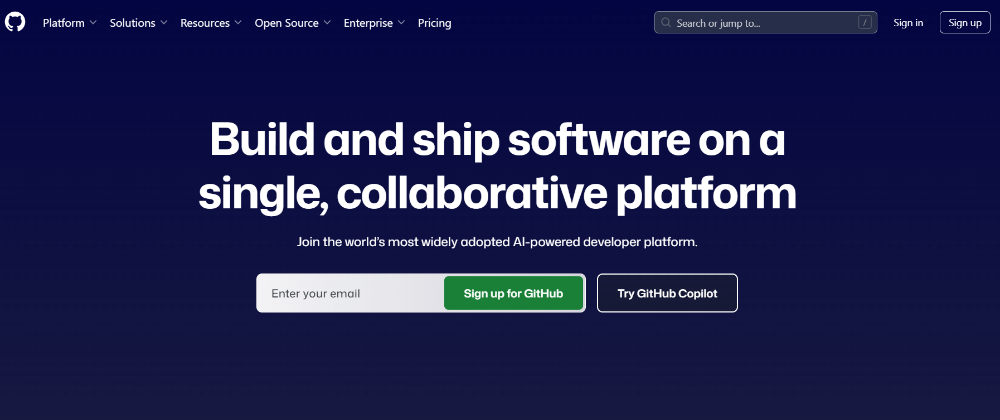
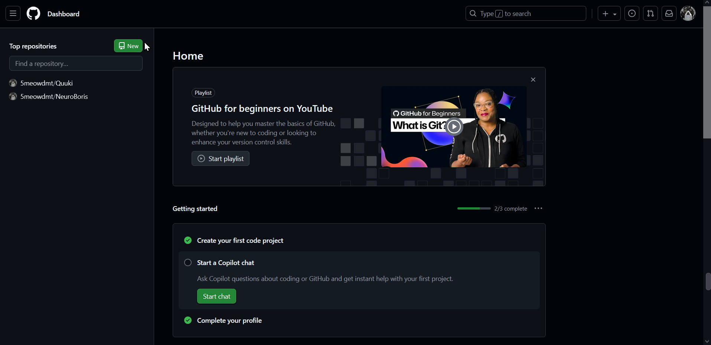
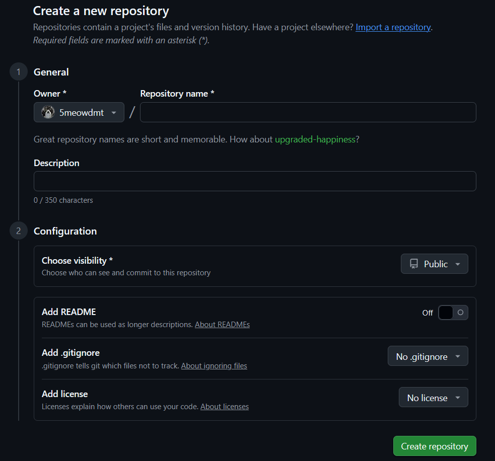
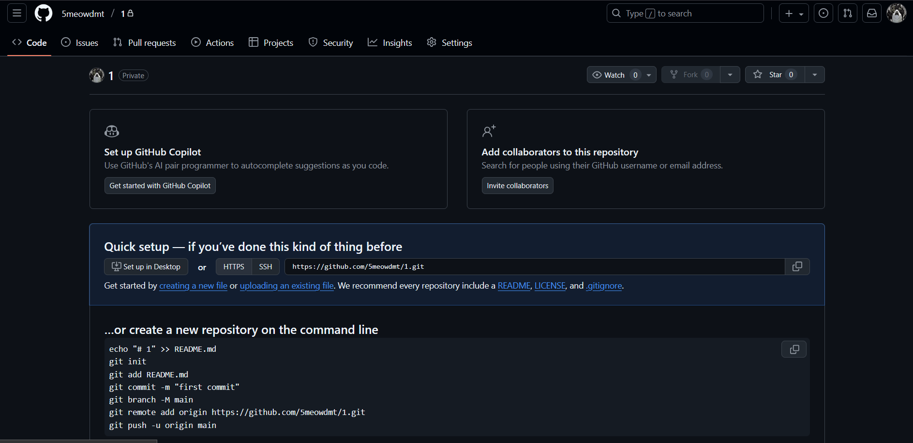
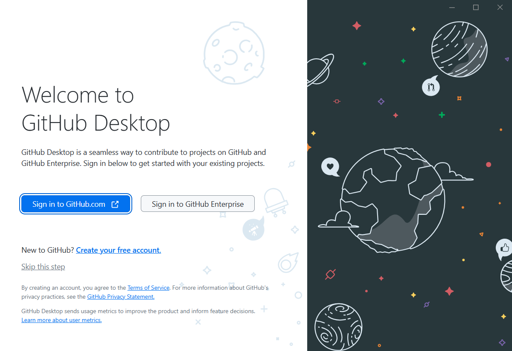
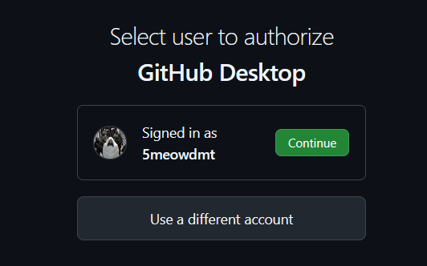
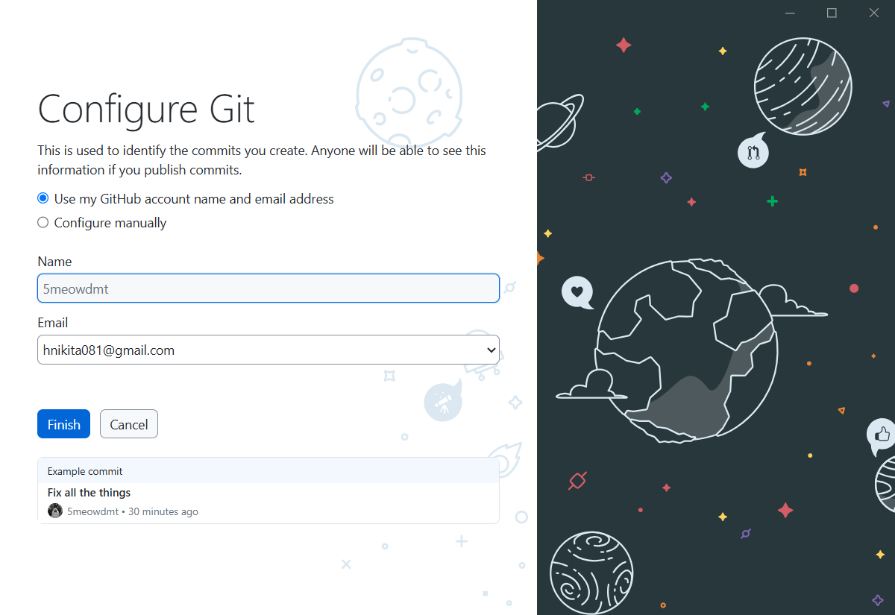
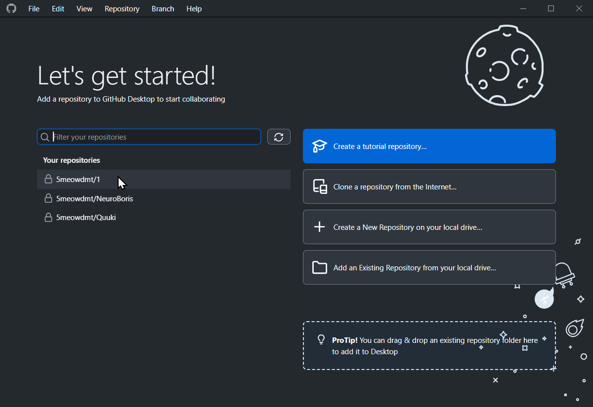
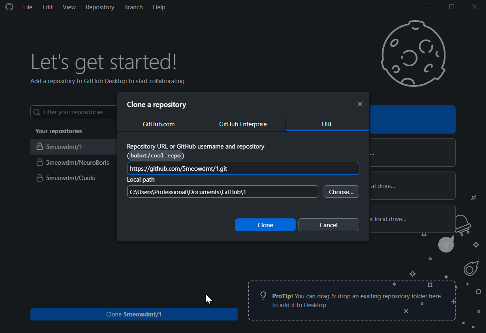

## Введение:

**GitHub** — это сервис для хранения IT-проектов и совместной  работы с кодом, используя систему контроля версий.

Основные функции GitHub:
1. **Хостинг репозиториев:** GitHub служит облачным хранилищем для проектов, позволяя загружать и управлять кодом удалённо.
2. **Контроль версий:** Помогает отслеживать все изменения в коде, создавать различные версии проекта и возвращаться к предыдущим.
3. **Совместная разработка:** Платформа облегчает сотрудничество между разработчиками, позволяя им работать над одним проектом одновременно.

Если вкратце, то GitHub — лучший друг программиста. Но для начинающих пользователей, UI(user interface) может показаться запутанным и сложным, поэтому дальше я постараюсь наглядно объяснить, куда надо тыкать, чтобы было хорошо.

## Начало работы (регистрация, репозиторий, проект):

Для начала работы нужно, как это не удивительно зарегистрироваться. Сделать это очень просто, как и на остальных сайтах с регистрацией:
1. Ищете в гугле GitHub и переходите по первой ссылке.
	
2. Вас встречает приветственный сайт с большой кнопкой *`Sign In`* или *`Sign Up`*.  Если вы никогда не пользовались гитхабом, то вам нужно нажать *`SignUp`* и выбрать удобный способ регистрации (через google или email). Если у вас уже есть аккаунт, то вам нужно просто зайти в свой аккаунт.
	
3. После успешной регистрации, вас перекинет на главную страницу, отсюда то и пойдет весь наш путь. Для того, чтобы где-то хранить свой проект, надо это "где-то" создать, репозитории это ваше основное место работы на гитхабе. Репозиторий это грубо говоря папка с вашим проектом. Чтобы создать "репу" вам нужно найти на главной странице раздел "`repository`" и нажать на кнопку "`new`".
	
4. Настройка максимально проста, но есть и свои подводные камни, так что по порядку: 
	1. Даёте своему репозиторию имя, желательно не использовать всякие *"1, аааа или рандомные символы"*, называйте репозиторий соответственно тому, что в нем будет храниться. Описание можно не добавлять, но в проектах направленных на публикацию это будет очень хорошим плюсом.
	2. **Choose visibility:** Кто сможет просматривать ваш репозиторий. *`Public`* - видят все пользователи, *`Private`* - видишь только ты и те, кто с тобой работает.
	3. **ReadMe:** Настройка позволяющая выбрать, создать текстовый файл или нет. В нем должно храниться обширное описание вашего проекта, для людей заинтересованных в нём.
	4. **Add .gitignore:** Тут уже всё становится интереснее. Файл гитигнор отвечает за игнорирование гитом файлов, которые вы не хотите выгружать на гитхаб. Чаще это IDEшный мусор *(кэш, временные файлы, файлы необходимые для работы конкретной ИДЕ и т.д.)*. В выпадающем списке, где по дефолту стоит *`No .gitignore`* надо выбрать язык программирования, который используется в вашем проекте, благо есть поиск.
	5. **Add license:** Лицензия на GitHub нужна, чтобы юридически определить, как другие люди могут использовать ваш код: можно ли его копировать, изменять, распространять, использовать в своих коммерческих проектах или только в личных целях. Без лицензии код защищен авторским правом, и никто не может его использовать без вашего прямого согласия. Но вам это скорее всего не важно, так что можете ничего не выбирать.
	
5. **Создание проекта:** Нажимаете кнопку *`Create repository`* и кайфуете.

## GitHub Desktop и commit'ы

После создания репы, вероятно, вам навалят на экран кучу непонятных кнопок и буков, но пугаться не стоит! Мы идем по пути меньшего сопротивления, так что большинство кнопок нам не понадобятся.

И так, вы создали репозиторий и увидели перед собой такую картину (или не такую, но это не важно):

Тут вам предлагают быструю установку репозитория на компьютер, ведь пока что он существует только на гитхабе. Самый выгодный и удобный для нас способ это установка проги ["GitHub Desktop"](https://desktop.github.com/download/). 

Давайте быстро пробежимся по установке и что там тыкать:
	1. Открыв установщик, вас встретят две кнопки, нам нужна синяя.
		
	2. Откроется страница с выбором аккаунта., выбираете свой и открываете прогу.
		
	3. Здесь просто оставляем как есть и жмем *`Finish`*.
		
	4. Откроется главное меню, выбираем из списка (вероятно у вас будет всего один) репозиторий, который создали и нажимаем *`Clone <reposytory's name>`*.
		
	5. Первое не трогаем, а вот второе, это путь до места, где будет храниться ваш проект, меняем как вам удобно или оставляем дефолт. *`Clone`*
	 

Пока устанавливаешь, я расскажу зачем вообще эта штука нужна:
1. **Это удобно!** И это единственный и главный фактор. Через эту прогу, можно удобно заливаать код на гитхаб, выгружать с гитхаба себе, добавлять описание обновлений и видеть историю того, что изменилось, а главное, что это все находится в удобном и интуитивном UI. 

После установки и всех нужных махинаций, тебя встретит главное меню, где... где опять ничего не понятно..

#### Разбираемся по порядку:
1. Поле *`Changes`*: Здесь будут отображаться файлы, которые вы как либо изменили и сами изменения.
2. Поле *`History`*: История ваших коммитов. Кто, что, когда и в каких количествах обновил в репозитории.
3. Поля *`Summary (required)`* и *`Description`*: Первое это краткий итог того, что изменилось, второе уже не такое краткое описание того же.
4. Кнопка *`Commit`*: Коммит это "обновление", "снапшот" вашего проекта. Грубо говоря, фиксация того, что вы наделали в файлах и запись на сервер.
5. Тут остановимся поподробнее. Кнопка, на которой сейчас написано *`Publish branch`*. Почему сейчас? Потому что надпись на кнопке будет меняться, как и функция, которую она выполняет. Функций у кнопки две (по крайней мере, вам понадобятся лишь две):
	1. Загрузить данные с сервера на компьютер — `Fetch`/`Pull`, у них есть отличие Fetch проверяет есть ли обновление и после предлагает его запулить, а Pull это просто пул
	2. Отправить данные на сервер — `Push`, нажимаешь и твой проект уже лежит на сайте.

## .gitignore

**Git ignore** — файл, содержащий правила игнорирования. Что это и для чего нужно, я уже описывал [[Гайд по GitHub - что это такое и как это есть#Начало работы (регистрация, репозиторий, проект)|здесь, пункт 4.4.]] Выглядит файл очень страшно и описывать что и куда надо тыкать мне не хочется, НО это может рассказать кто-нибудь другой, а я просто оставлю тут свой  . Обратите внимание, что этот файл сохранен в формате `.md`, лучше всего создайте свой и просто сравнивайте, но если решите перенести именно этот файл, то следите уберите из названия `.md`, чтобы было просто `.gitignore`!!!

## Совместная работа:

Работать одному, конечно хорошо, но вдвоем веселее, так что надо бы узнать, а как это делается. Да, к сожалению, просто сказать, что вы работаете сообща не получится.
![[./resourses/repo page.png]]
На главной странице (если вам повезло) у вас будет кнопка *`Invite collaborators`*, если кнопки нет, а страница выглядит так:
![[./resourses/another repo page.png]]
Тыкаем на *`Settings`*, а далее у всех шаги одинаковые ![[./resourses/settings collab.png]]

1. Во вкладке *`Collaborators`* нажимаем на кнопку *`Add people`*, в поле поиска пишем никнейм вашего "коллеги" и отправляем ему приглашение в проект.
2. "Коллега" принимает приглашение и теперь ему также доступен репозиторий и возможность с ним взаимодействовать.
## Итог:

Важно помнить, что GitHub это не страшно, научившись пользоваться гитом, вам открываются огромные возможности и удобства. Короче я устал это писать, всем бб и удачи! 
